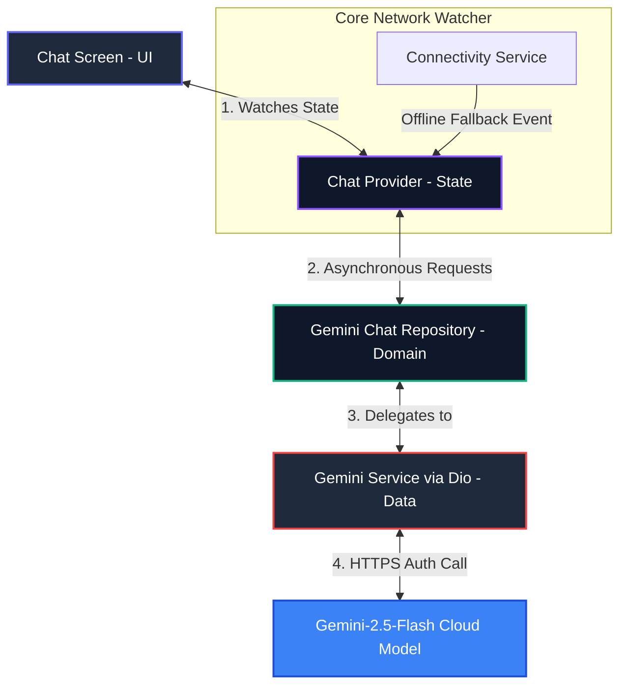

# NexaAI Chatbot 🚀

[](https://flutter.dev)
[](https://dart.dev)
[](https://ai.google.dev/)
[](https://riverpod.dev)
[](LICENSE)

NexaAI is a production-grade, highly optimized Android virtual assistant application built with Flutter. It implements Clean Architecture, reactive state management using **Riverpod**, and Google's high-performance **Gemini 2.5 Flash API** for real-time dialogue processing.

---

## 🎨 System Architecture & Data Flow

NexaAI relies on a decoupled, unidirectional data stream. The presentation layer never interacts directly with low-level network caches, preserving a strict separation of concerns.



---

## 📂 Project Directory Structure

Adhering to standard **Clean Architecture** patterns, the source code separates the domain and data layer from layouts, facilitating easy maintenance and extensibility.

```text
lib/
├── main.dart                 # Initialized bindings, loads environments, and runs ProviderScope
├── app.dart                  # High-level MaterialApp config attaching the dark theme system
├── app_router.dart           # Custom Navigator handling page routing streams
│
├── core/                     # Cross-cutting concerns and shared modules
│   ├── theme/
│   │   └── app_theme.dart    # Premium dark palettes (#0F172A slate scaffolds, indigo overlays)
│   └── services/
│       └── gemini_service.dart   # Dio connection manager targeting gemini-2.5-flash
│
└── features/                 # Decoupled business capabilities by feature module
    └── chatbot/              # Modular Chatbot Feature
        ├── data/             # Models and repositories executing HTTP transactions
        │   ├── models/
        │   │   └── chat_message_model.dart       # Model parsing prompt JSON inputs & outputs
        │   └── repositories/
        │       ├── chat_repository.dart          # Protocol contract interface for chatbot
        │       └── gemini_chat_repository.dart   # Concrete implementation routing messages to Gemini
        │
        └── presentation/     # UI Pages, providers, and modular rendering widgets
            ├── providers/
            │   └── chat_provider.dart            # Listens to typing states, app connection and API
            ├── screens/
            │   └── chat_screen.dart              # Chat container with active connectivity banner
            └── widgets/
                ├── chat_bubble.dart              # Bouncing list tiles, user/AI layouts, and copying
                ├── chat_empty_state.dart         # Dashboard splash welcome panel
                ├── chat_input_bar.dart           # Text inputs with animated action icons
                └── typing_indicator.dart         # Bouncing dot sequence mimicking real agent typing
```

---

## 🔥 Key Features & Capabilities

### ⚡ 1. Live Gemini 2.5 Flash Integration
* Connects dynamically to the latest generation of Gemini models for instantaneous, low-latency, and highly intelligent AI replies.
* Uses custom interceptors to parse API errors (such as quota exhaustion) and alerts the user to toggle simulation mode.

### 🌐 2. Reactive Connectivity & Offline Simulator
* Watches active network interfaces dynamically using `connectivity_plus`.
* If the user goes offline, a beautiful top banner notifies them immediately, and the app seamlessly toggles into **Offline Simulator Mode** to keep dialogues functioning without throwing network exceptions.

### 💎 3. Gorgeous Premium UI / UX
* Stunning edge-to-edge layout styling featuring a slate-dark modern color scheme.
* Dynamic sequential bouncing dot loading animations that replicate live messaging applications.
* Fluid auto-scroll systems and clean one-tap message clipboard copying.

---

## 🛠️ Local Development & Setup

### Prerequisites
* Flutter SDK (v3.x or higher) installed.
* Active Android Studio or VSCode setup.

### Step 1: Clone the Repository
```bash
git clone https://github.com/Nash-wa/NexaAI-chatbot.git
cd NexaAI-chatbot
```

### Step 2: Configure Environment Variables
Create a file named `.env` in the root of the project:
```env
GEMINI_API_KEY=your_actual_gemini_api_key_here
```

### Step 3: Fetch Packages & Run
```bash
flutter pub get
flutter run
```

---

## 📦 Compilation & Release Build
To compile a highly optimized, production-grade Release APK, run:
```bash
flutter build apk --release
```
* The compilation utilizes tree-shaking on icons and assets, compressing the output binary size down to **47.9 MB** (from 145 MB in debug mode).
* The resulting package will be compiled directly to:
  `build/app/outputs/flutter-apk/app-release.apk`
